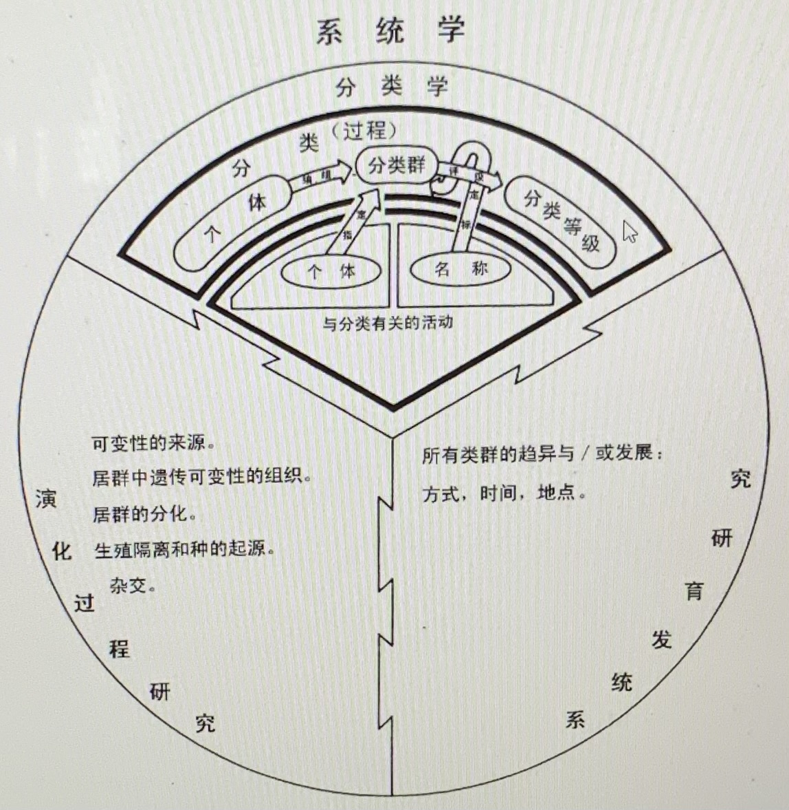
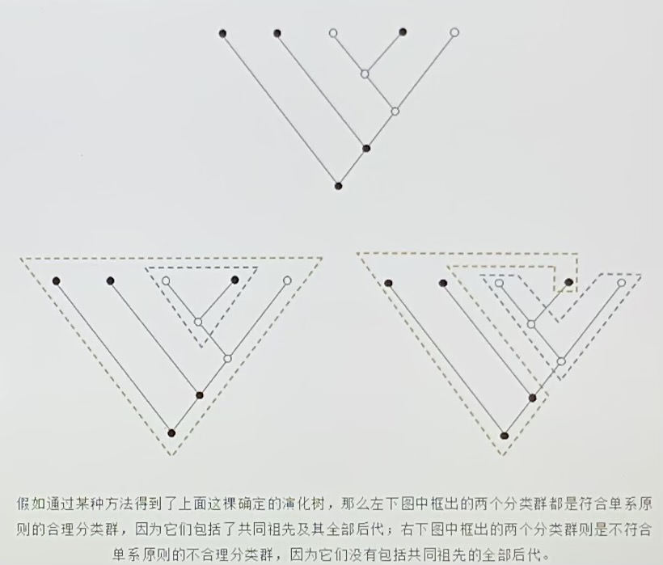

# [今天的分类学在做什么？](https://mp.weixin.qq.com/s/jb0ggBubF8EKSisJ1zTkog)（作者：刘夙）

## 分类学定义 taxonomy

<!---  --->

（from Tod F. Stuessy, Plant Taxonomy, 2009)

## 分类学的主要内容

分类学主要的工作是分类，而不是鉴定（所谓的认花认草）。

分类的两个基本过程：第一是把个体编组为类群（to group）；第二是把分类群评定到分类等级系统中的合适等级（to rank）。由此，建立分类系统。

## 当今分类学家建立的分类系统的主要方法（分子支序学 molecular cladistics）

1. 第一步：支序学 cladistics

意义：确定了什么样的分类群是有意义丶值得研究和命名的

单系原则

<!---  --->

2. 第二步：大分子测序（DNA，也可用RNA或蛋白质）

提供了判定不同分类群彼此亲缘关系的最可靠证据

需要依赖高深的数学理论（主要是通过随机过程理论）和高超的编程技术
（数学+算法，可利用工具如python）

## 分类系统发展

* 分子支序学应用前的著名被子植物分类系统

德国：恩格勒—普兰特尔 Engler-Prantl

英国：哈钦松 Hutchinson

美国：克郎奎斯特 Cronquist

苏联：塔赫塔江 Takhtajan

丹麦：达尔格伦 Dahlgren

匈牙利：索奥 Soó

中国：吴征镒 张宏达

* 科以下的系统分类混乱，较大的科里总有“归拢派”(lumper)和“分裂派”(splitter)争论不休

* 现今公认的系统：被子植物系统发育研究组发布的APG系统，目前APG IV

## 现存分类学的问题

即使在分子支序学革命之后，分类系统的建立（既包括分类群的界定，也就是从个体到分类群的编组，又包括分类群的评级）仍然有一定主观性。如木兰科。

## 中国新一代分类学家展望

* 最紧迫：把APG系统之类分子分类系统落实到属、种一级，建立中国植物以至全世界植物的新科属名录。如昆明植物所、北京植物所出版的工具书

* 扩展：把绿藻丶红藻以及现在不属于植物的其他藻类包括进来

* 更新教科书

# 扩展资源

* 上海辰山植物园: [多识植物百科](http://duocet.ibiodiversity.net/index.php?title=%E9%A6%96%E9%A1%B5)
